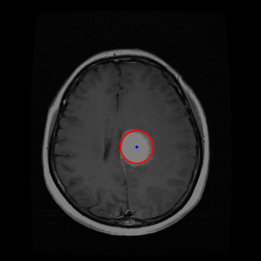

# Image Processing with PySide6 and OpenCV

## Description
This project is a GUI application for image processing using PySide6 and OpenCV. It allows users to apply filters, detect edges, perform blurring, and visualize transformations like the magnitude spectrum of images.

## Features
- **Load Images:** Select an image file to load into the application.
- **Apply Filters:**
  - Threshold filters (adjustable via sliders).
  - Gaussian blur with customizable kernel size.
- **Edge Detection:** Use the Canny edge detection algorithm.
- **Circle Detection:** Detect circles in grayscale images (e.g., X-ray or MRI images).
- **Precise Edge Detection:** Visualize precise edges using the Scharr operator.
- **Magnitude Spectrum:** Display and save the magnitude spectrum of an image.

## Installation
1. Install Python 3.9 or later.
2. Clone this repository:
   ```bash
   git clone https://github.com/irem-t/image-processing-app.git
   ```
3. Navigate to the project directory:
   ```bash
   cd image-processing-app
   ```
4. Install the required dependencies:
   ```bash
   pip install -r requirements.txt
   ```

## Usage
1. Run the application:
   ```bash
   python main.py
   ```
2. Use the GUI to load an image and apply desired operations.

## Dependencies
- PySide6
- OpenCV
- Matplotlib
- NumPy

## Screenshots

### Main Window




## Contributing
Contributions are welcome! Please open an issue or submit a pull request if you have suggestions or improvements.


---

### Notes
Ensure your system has a proper Python environment setup before running the application. If you encounter issues, check that all dependencies are correctly installed. This project was designed as part of the Introduction to Python course of Ankara University Biomedical Engineering department.

